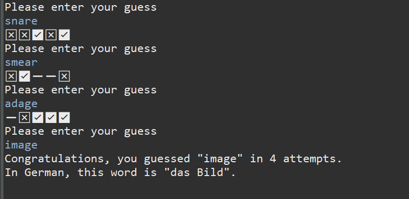

# Wordle Project - Java Console Application

This is a Wordle project that runs in the Java console.
This was made in Eclipse as part of my time with \_nology.

## Design

As this is a console project, most of the design elements weren't too hard to figure out.
I decided to incorporate emojis to indicate correct and incorrect letters/locations of letters, instead of using simply words or symbols.

## Functionality

The game selects a word from a predefined list found in the WordleList class. A function then retrieves a word at a random index and returns this word to the main class, which opens a scanner and takes in user guesses. The user gets 6 guesses, which is enforced through a for loop.

If the user guesses the word within the 6 guesses, a congratulatory phrase will display along with the word's translation in German, and the number of guesses it took for the user.

If the user does not guess the word within 6 guesses, the system will return the word and its translation.

### Edge cases

-   If the user enters a word that is longer or shorter than 5 letters, a response is given asking the user to submit a 5-letter word. This does not increment the user's guesses, nor does the user receive any feedback.
-   If the user enters a string containing numbers or other non-alphabetic characters, a response is provided and, again, their guesses are not incremented.

## What's Next

I'd like to make this into a front-end Javascript application, so that it can be played in the browser. I may also attempt to turn it into a phone game e.g. via Kotlin.

I would also like to be able to return a grid of emojis showing the course of the user's incorrect guesses, similar to the ones Wordle has.
